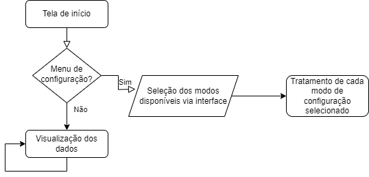
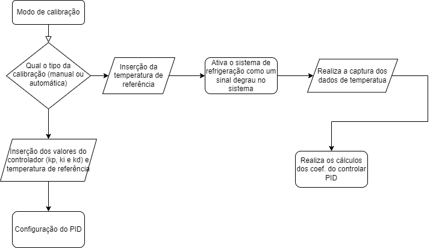
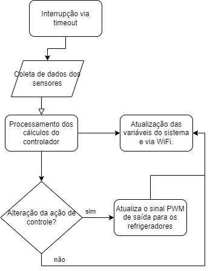

# `Controle de temperatura robusto`

# `Robust temperature control`

  

## Apresentação

  

O presente projeto foi originado no contexto das atividades da disciplina de graduação *EA075 - Sistemas Embarcados*,

oferecida no primeiro semestre de 2023, na Unicamp, sob supervisão da Profa. Dra. Paula Dornhofer Paro Costa, do Departamento de Engenharia de Computação e Automação (DCA) da Faculdade de Engenharia Elétrica e de Computação (FEEC).

  
|Nome | RA | Curso|
|--|--|--|
| Felipe dos Reis Lemos | 204069 | Eng. Elétrica|
| João Paulo Christofolletti | 199681 | Eng. Elétrica|

 
## Arquivos Importantes (:warning: NOVO :warning:)

Esquemático em PDF: https://drive.google.com/drive/folders/1psIWRqpMZ8m5IryysbpZkoGed2PQm9Vj?usp=drive_link

Lista de Componentes: https://github.com/JoaoPauloChristofolletti/ea075-2023.1/blob/main/projetos/Controle_de_temperatura_robusto/Lista_de_componentes

PCB: https://drive.google.com/drive/folders/1PhZeodno1dpjqo32BKYxaNE4ILYXM0Dg?usp=drive_link
  

## Descrição do Projeto 
O mal controle de temperatura pode interferir em diversos processos industriais, especialmente tratando-se de produtos sensíveis a alterações ambientais como os dos setores farmacêutico e alimentício. Logo, o controle dessa variável é fundamental para garantir que o padrão de qualidade seja atingido, pois a falta de controle sobre a temperatura do ambiente pode resultar em desperdício dos produtos, o que significa prejuízos financeiros. Há equipamentos que necessitam também atuar dentro da faixa de temperatura indicada pelos fabricantes, ou poderão apresentar defeitos.

Diante disso, este projeto tem como objetivo realizar o controle de temperatura de um determinado ambiente de forma robusta utilizando a média ponderada de quatro sensores de temperaturas espalhados pelo ambiente e usando um controle PID. Pode-se ser desde um ambiente industrial, onde se encontra uma linha de produção que necessita de uma temperatura uniforme ao longo de todo o percurso, por exemplo, ou um ambiente residencial, o qual pode ser um cômodo ou a casa inteira. Portanto, é esperado uma maximização da eficiência energética e consequentemente o controle mais preciso e uniforme da temperatura do local escolhido pelo cliente, garantindo assim maior qualidade sobre seu produto.

O público alvo são empresas ou pessoas específicas, as quais desejam uniformizar, maximizar e obter uma maior eficiência energética em relação a refrigeração presentes em suas residências, e empresas as quais necessitam garantir um controle preciso da temperatura em sua linha de produção, por exemplo, para que possam aumentar a qualidade e confiabilidade de seus produtos.

Um controle de temperatura por PID é uma tecnologia avançada que permite um controle preciso da temperatura em processos industriais. Isso pode resultar em economia de energia e aumento da eficiência do processo de controle. Além disso, é um tipo de controle amplamente utilizado nas mais diversas complexidades da indústria, não somente em processos simples.
 
O controle por PID tem a capacidade de ajustar a intensidade de resfriamento com alta precisão. Isso acontece porque eles levam em consideração a temperatura ideal a ser atingida. 
 
São sistemas que requerem controle preciso de temperatura. O controlador PID é amplamente utilizado em diversas áreas, como indústrias alimentícias, farmacêuticas, químicas, de plásticos, entre outras.

O valor econômico pode ser calculado a partir da análise de indicadores de desempenho, como o tempo de produção, a maximização do consumo de energia, o consumo de matérias-primas. Dessa forma, é possível determinar o retorno sobre o investimento em um controlador PID de temperatura e compará-lo com outras alternativas de controle de temperatura.

## Descrição Funcional 

### Funcionalidades

As funcionalidades principais do projeto são:

1. Fazer a média ponderada dos quatros sensores de temperaturas, pois assim há uma garantia maior de que o ambiente está numa temperatura uniforme

2. Com base no resultado da média da temperatura do ambiente, o sistema identifica se há necessidade ou não de atuar no sistema de refrigeração para manter a temperatura mais próxima da requerida pelo usuário

3. Há uma interface com o usuário para que ele consiga estabelecer as temperaturas desejadas e, caso haja necessidade, pode resetar o sistema e iniciar novamente.

4. Comunicação com a rede para enviar os dados em tempo real para a nuvem, para o firebase, por exemplo. 

5. Indicação por leds de quando o sistema está ou não funcionando corretamente

6. Não exige uma curva de aprendizado grande do usuário, pois todo o sistema será intuitivo e de fácil entendimento e operação
 
### Configurabilidade

Módulo de comunicação Wi-Fi

O microcontrolador será o ATMEGA328P, pois ele atende muito bem os objetivos do projeto

Circuito para codificar as informações enviadas para a nuvem. (retirar?)

Leds de sinalização, sendo um verde indicando que o sistema está operando corretamente, outro amarelo indicando que o sistema está pausado esperando o usuário iniciá-lo e um vermelho indicando que o sistema não está funcionando corretamente e precisa ser reiniciado.

Teclado numérico para que o usuário possa definir o valor da temperatura desejada

Sensor de temperatura: O controlador deve ser capaz de trabalhar com diferentes tipos de sensores de temperatura, como termopares e termistores.

Saída de controle: O controlador deve ser capaz de fornecer a saída de controle adequada para o sistema, seja por meio de um sinal analógico, PWM (Modulação por Largura de Pulso) ou outro método.

### Eventos

Medição periódica dos sensores de temperatura: como medição de forma discretizada da temperatura, por exemplo, em um período de 1s.

Após, realizar os cálculos pelo controlador de qual o sinal de saída para o controle da temperatura no ambiente (periódico, acompanha a medição)

Envios dos dados para o servidor (Firebase)

Configuração (não-periódico) depende do usuário o acionamento, como a calibração automática ou manual dos dados, além da inserção do setpoint (temperatura alvo) do sistema de controle

Exibição no display (periódico) dos dados, entra no loop do sistema e atualiza os valores, conforme cálculos

### Tratamento de Eventos

Leitura de dados: ser capaz de ler e monitorar os dados de temperatura em tempo real, utilizando sensores e/ou termopares. Pois esses dados serão usados para o cálculo do controle do sistema.

Cálculo do erro: O sistema deve ser capaz de calcular o erro entre a temperatura medida e a temperatura desejada, utilizando a lógica do controlador PID.

Cálculo de controle: a ação de controle necessária para corrigir o erro e trazer a temperatura de volta ao valor desejado, utilizando a lógica do controlador PID. É nessa etapa que há o cálculo do controle em relação aos coeficientes do controlador kp, ki e kd.

Acionamento de ações: acionar ações específicas de acordo com o tipo de evento, como por exemplo, acionar uma saída de controle para ajustar a temperatura, ou desligar algum dispositivo. O sinal de controle é o acionamento do sistema de resfriamento realizado por ventiladores, por meio de um fluxo de ar relativo ao cálculo do controlador, que é um sinal PWM.

Registro de informações: registrar as informações relevantes de cada evento, como as leituras de temperatura, os valores do erro e do controle. Deve armazenar e enviar as informações para o usuário.

Comunicação com os usuários: comunicar os eventos relevantes aos usuários, como alarmes de temperatura, para que eles possam tomar as medidas necessárias e acompanhar o status do processo, além de dados de configuração e informações em tempo real.
 
Calibração: realiza uma parametrização com o auxílio do usuário, para configuração do controlador de temperatura (kp, ki e kd), através de algum método de controle, por exemplo, métodos de Ziegler-Nichols
  
## Descrição Estrutural do Sistema
Atuadores:
- Sinal PWM para os ventiladores
- Acionamento da refrigeração: exaustor, condensador.

Sensores:
- Sensores de temperatura: a quantidade colocada no ambiente

Comunicação:
- Módulo WiFi para envio dos parâmetros para a nuvem
- Botões, teclado numérico, display e LEDs para a comunicação com o usuário

Controlador:
- Microcontrolador ATmega que realiza os cálculos

## Especificações 

### Especificação Estrutural 

Para cumprir com os objetivos propostos e não tornar nosso projeto muito complexo e caro, decidimos por utilizar o microcontrolador ATmega328P, que é o mesmo utilizado no Arduino. Portanto já existe um grande acervo de materiais disponíveis para consulta e uma grande comunidade que utiliza esse microcontrolador, assim facilita o desenvolvimento deste projeto. 

A distribuição dos quatro sensores de temperatura será feita de modo que a média deles tente representar muito bem o ambiente, ou seja, colocando um mais afastado do sistema de resfriamento do ambiente, outro perto e os outros dois na metade entre a parte mais distante do cômodo até o sistema de resfriamento. A figura abaixo mostra dois exemplos de ambientes e os pontos em preto representam exemplos de onde os sensores de temperaturas podem ser colocados.

Para poder medir a temperatura do ambiente escolhemos o termômetro digital DS18B20, pois ele não necessita de nenhum módulo adicional, ou seja, pode ser conectado dirematente nas entradas GPIO's do microcontrolador que iremos utilizar e é relativamente barato. Para que seja possível essa comunicação entre o sensor e o ATmega teremos que definir as entradas do microcontrolador e utilizaremos bibliotecas disponíves e vamos ter que definir os endereços de momória, uma vez que, pretendemos utilizar uma única porta para os quatros sensores.
 
Para mostrar as informações, iremos utilizar um display OLED 128x64 que possui compatibilidade com o microcontrolador que escolhemos, pois ele consegue mostrar diversar informações utilizando apenas duas portas de dados e seu custo é relativamente baixo.

O teclacdo númerico escolhido foi um do tipo matricial por ele possuir um custo baixo e nos da diversas opções de implementação e para o usuário final ele é muito simples de operar
 
Iremos utilizar um LED verde, um amarelo e um vermelho para poder sinalizar o usuário o estado do dispositivo como foi descrito anteriormente. E também terá os botões para que o usuário possa realizar alguns comandos, além do teclado numérico.
 
O módulo Wi-Fi será o ESP8266, o qual possui compatibilidade com o microcontrolador que estamos utilizando e há diversos materiais na internet de como realizar as configurações necessárias para poder utilizá-lo com o ATmega. Para poder conectá-lo, vamos ter que definir uma porta como TXD e outra como RXD para receber e enviar os dados via Wi-Fi
 
O acionamento do sistema de refrigeração será feito através de um sinal PWM de saída para os refrigerados
 
Vamos utilizar também um cristal oscilador de 16 MHz como clock
 
Todos os links com os datasheets ou especificações dos componesntes principais que iremos utilizar estão em referências

### Especificação de Algoritmos 

A especificação dos algoritmos é ilustrada em 3 fluxogramas:

#### Interface do usuário:

- Tela de início e inicialização do sistema.

- Menu de configuração exibindo opções como calibração e rede Wi-Fi.

- Se houver uma interrupção via teclado/encoder, exibir opções de configuração.

- Se nenhuma interrupção for identificada, o display continua mostrando os dados ao usuário.

#### Modo Calibração:

Início da calibração selecionando no menu.
Opção para o usuário inserir os valores manualmente ou realizar um teste automático para o cálculo dos coeficientes.
Atualização dos valores do controlador.

#### Funcionamento do controlador:

- Realização das medições dos sensores do sistema em intervalos definidos.
- Cálculos para ativação do controle e verificação de eventos necessários para manter a temperatura controlada dentro dos limites desejados.
- Se não houver mudança no setpoint (diferença entre a temperatura de referência e a temperatura do sistema), apenas atualiza as variáveis do código.

## Referências 
-  SILVA, Italo. UTILIZAÇÃO DE UM CONTROLE PID DE TEMPERATURA PARA ESTUDO DE RESFRIAMENTO TERMOELÉTRICO. 2022. Monografia (Graduação em Engenharia Mecânica) - UFPE, [S. l.], 2022. Disponível em: https://repositorio.ufpe.br/bitstream/123456789/47590/1/TCC%20%C3%8Dtalo%20Souza%20da%20Silva.pdf. Acesso em: 2 abr. 2023.

- PRATA, Tiago; CAMPO, Alexandre. Desenvolvimento e aplicação de controle preditivo baseado em modelo (MPC). Sociedade Brasileira de Automática, [S. l.], p. Vol 2 No 1, 8 dez. 2020. DOI https://doi.org/10.48011/asba.v2i1.1187. Disponível em: https://www.sba.org.br/open_journal_systems/index.php/cba/article/view/1187. Acesso em: 2 abr. 2023.

- Datasheet do micocontrolador ATMEGA328P: https://www.ic-components.hk/files/cb/DEV-14083.pdf

- Datasheet de termômetro: https://pdf1.alldatasheet.com/datasheet-pdf/view/58557/DALLAS/DS18B20.html
 
- Link do módulo Wi-Fi: https://nurdspace.nl/images/e/e0/ESP8266_Specifications_English.pdf
   
- Link do display OLED: https://datasheethub.com/ssd1306-128x64-mono-0-96-inch-i2c-oled-display/
  
- Datasheet do display: https://www.usinainfo.com.br/index.php?controller=attachment&id_attachment=131
 
- Datasheet do cristal oscilador: https://www.eletrogate.com/cristal-oscilador-16mhz

- Link do teclado numérico: https://www.robocore.net/botao-chave/teclado-matricial-de-membrana-16-teclas

