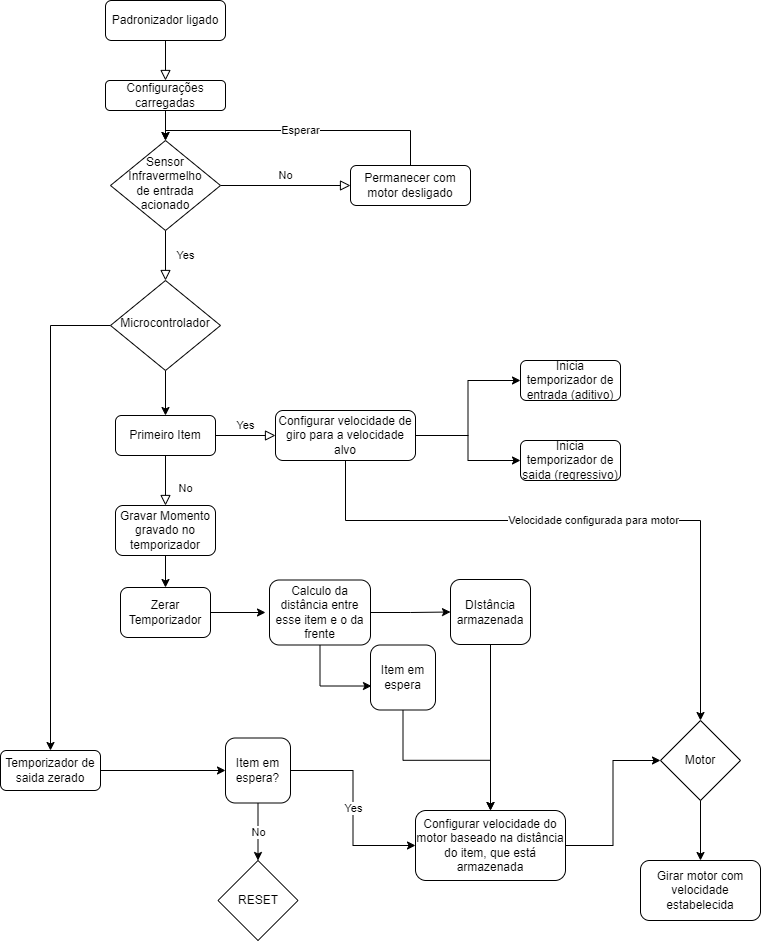

# `Padronizador Variável de Linha de Produção`
# `Variable Line Production Standardizer`

## Apresentação

O presente projeto foi originado no contexto das atividades da disciplina de graduação *EA075 - Sistemas Embarcados*, 
oferecida no segundo semestre de 2022, na Unicamp, sob supervisão da Profa. Dra. Paula Dornhofer Paro Costa, do Departamento de Engenharia de Computação e Automação (DCA) da Faculdade de Engenharia Elétrica e de Computação (FEEC).

> |Nome  | RA | Curso|
> |--|--|--|
> | Marcelo Montandon Magalhães  | 259118  | Eng. Elétrica|
> | Victor Mario Bertini  | 194761  | Eng. Elétrica|

## Descrição do Projeto
>Este projeto surge como um otimizador de linhas de produção. No contexto de linhas de produção, 
>os produtos que serão manufaturados são transportados por uma esteira transportadora equidistantes uns dos outros,
>dando assim um tempo padronizado para as máquinas e trabalhadores do chão de fábrica trabalharem no produto. 
>Entretanto isto nem sempre acontece, existem casos onde os produtos são transportados amontoados 
>ou muito espaçados uns entre os outros, em ambos os casos há problemas, se os produtos estiverem amontoados, 
>há maior chance de perda de produtos, onde os trabalhadores/ máquinas não conseguiram trabalhar em todos, 
>necessitando descarte, e, no caso deles estarem muito espaçados, há o problema de aumento no tempo de manufatura, 
>que também é uma perda para a fábrica.

>Este produto tenta resolver isso, padronizando as distâncias entre os produtos nas esteiras, 
>assim evitando ambos os casos e podendo aumentar/diminuir o fluxo de produtos dependendo da necessidade para a manufatura.

>O problema que será resolvido é pontual, e, igualmente, o projeto irá resolver ele pontualmente, com baixo número de componentes, 
>necessitando apenas de um sensor simples, um microcontrolador (MCU), dois temporizadores, 
>uma para controlar os momentos da entrada de itens e outra para contar, regressivamente, a saída, e um motor (de preferência DC).

## Descrição Funcional
>O padronizador funciona utilizando um sensor infravermelho que detecta a presença de produto passando 
>e o tempo no qual eles passaram, com essas informações ele varia a velocidade da esteira, 
>assim regulando a distância entre os produtos. 
>Por exemplo, caso a necessidade de entrega de produto for de 1 produto/10 segundos, 
>e ele detecta um produto no momento t = 1 e outro no t = 9, com Δt = 8s, após a entrega do primeiro produto, 
>ele irá desacelerar a  esteira para entregar o segundo produto com o atraso pedido de 10s.

### Funcionalidades
* Detecção de Produtos por meio do sensor infravermelho:
  * Item chega na esteira conectada com o padronizador, passando pelo sensor
  * Sensor registra o momento de passagem 
* Cálculo de distância entre dois produtos em sequência:
  * Momento da passagem é usado em comparação com o segundo item e com a velocidade da esteira para calcular a distância entre os items
  
* Aceleração ou diminuição da velocidade da esteira de acordo com a quantidade e distância entre o próximo item na esteira e o final da esteira:
  * Aciona um valor de tensão para o motor DC regulando a velocidade desejada para a chegada do produto

### Configurabilidade
> Configurado para funcionar em apenas um modo

### Eventos
* Passagem de item pelo sensor (não periódico)
* Item saindo da esteira (não periódico)

### Tratamento de Eventos
* Passagem de item pelo sensor (não periódico):
  * Para esse evento o padronizador deve registrar o momento de passagem referente a esse produto
  * Ele deve comparar esse valor registrado com o valor do item anterior a ele, para calcular sua distância
  * Caso o item em questão seja o primeiro ele deve ser tratado de maneira diferente
* Item saindo da esteira (não periódico)
  * O motor deve ser ajustado para um novo valor de velocidade, referente ao próximo item, sempre que o mais a frente sai da esteira
  * Esse saída do item pela esteira deve ser estimado pelo microcontrolador, baseada na velocidade da esteira em em seu tamanha (ou sua distância para o fim da esteira)

## Descrição Estrutural do Sistema

## Referências
> Seção obrigatória. Inclua aqui referências utilizadas no projeto.
