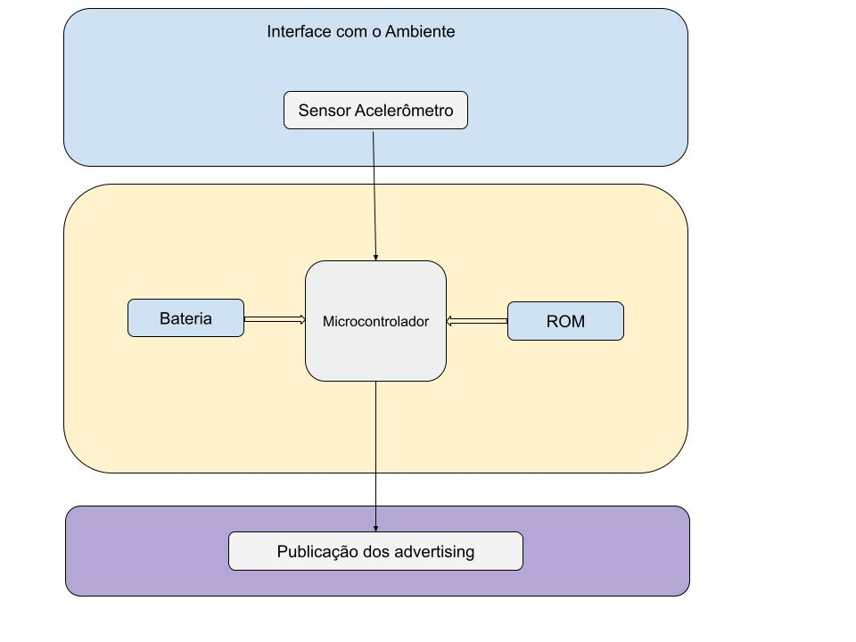

# `Sismógrafo com comunicação Bluetooth`
# `Seismograph with Bluetooth communication`

## Apresentação

O presente projeto foi originado no contexto das atividades da disciplina de graduação *EA075 - Sistemas Embarcados*, 
oferecida no primeiro semestre de 2023, na Unicamp, sob supervisão da Profa. Dra. Paula Dornhofer Paro Costa, do Departamento de Engenharia de Computação e Automação (DCA) da Faculdade de Engenharia Elétrica e de Computação (FEEC).

 |Nome  | RA | Curso|
 |--|--|--|
 | Rodrigo Dutra de Freitas Cardoso  | 205513  | Eng. Elétrica|
 | Vinicius de Lima Quadrado  | 225357  | Eng. Elétrica|

## Descrição do Projeto
 Com o intuito de prever catastrofes naturais e assegurar que vidas possam ser poupadas, os alunos da Engenharia Elétrica da Unicamp, juntamente com os conhecimentos desenvolvidos na Disciplica de Sistemas Embarcados, desenvolveram um Sismógrafo com interface de comunicação Bluetooth.

 O projeto consiste em uma implementação de um Sensor Acelerômetro e um chip de BLE(Bluetooth Low Energy) para realizar aquisição de dados de vibração do solo, enviando para análise na nuvem e gerando relatórios em tempo real de ondas causadas por possíveis terremotos.

 O sistema completo que este projeto trata corresponde a um beacon sensor, responsável por detectar ondas sismicas, processar os dados recolhidos e emiti-los via advertisings BLE e também por um beacon receptor, que colhe os advertisings dos beacons sensores e os envia para a nuvem, no entanto **estamos limitando o escopo do projeto a apenas o beacon sensor**.

## Descrição Funcional
 Para aquisição dos dados de vibração do  solo será usado um sensor que mede as alterações de posição em relação ao local onde estiver instalado. Estas informações serão  enviadas via Bluetooth para uma central, onde serão analisadas e relatórios serão emitidos de acordo com a necessidade ou urgência de eventos serem informados para que medidas sejam tomadas.  

### Funcionalidades
 - Beacon sensor
   - Tratar dados crus provenientes dos sensores
   - Emitir em advertisings BLE com os dados processados
 - Beacon receptor
   - Receber dados processados de diversos beacons sensores
   - Enviar dados para a nuvem.

### Configurabilidade
 O usuáriuo poderá configurar os seguintes itens:
	- frequência com a qual será captadas as oscilações do solo
	- potência de comunicação via Bluetooth
 	- taxa de amostragem das oscilações

### Eventos

Os eventos tratados para o sistema serão:

1. Captura das ondas sísmicas
2. Filtragem e processamento dos sinais
3. Emissão dos advertisings contendo os dados tratados

Todos os eventos são periódicos, de frequência **F** a determinar em ensaios. Essa frequência deve ser tal que as frequências de onda mais comuns de eventos sísmicos possam ser detectadas precisamente.

### Tratamento de Eventos
 Para tratar os eventos vamos separar em três etapas:
	1 - propagação das ondas Sísmicas são captadas pelo sensor Acelerômetro
	2 - há um pré-tratamento dos dados, de forma que somente os dados considerados válidos serão guardados
	3 - envio dos dados para o beacon receptor 

## Especificações

### Estrutural
Utilizando o módulo BLE EFR32BG13 da Silicon Labs e o Acelerômetro ADXL345.

### Algoritmos

## Descrição Estrutural do Sistema

## Referências
Decifrando a Terra. . São Paulo: Companhia Editora Nacional. . Acesso em: 02 abr. 2023. , 2009

Anthony, Robert & Ringler, Adam & Wilson, David & Wolin, Emily. (2018). Os sismógrafos de baixo custo funcionam bem o suficiente para a sua rede? Uma visão geral dos testes de laboratório e observações de campo do Raspberry Shake 4D da OSOP. Seismological Research Letters. 90. 10.1785/0220180251.
